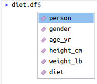
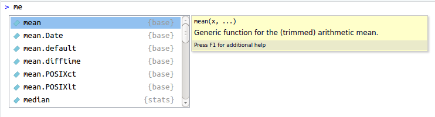
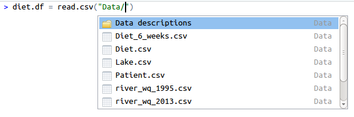
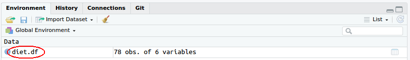
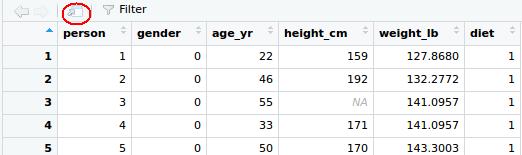
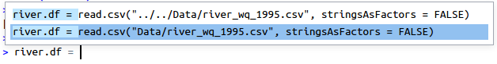
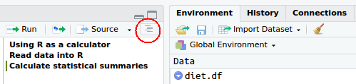

```{r setup, include=FALSE}
knitr::opts_chunk$set(echo = TRUE, fig.pos = "H")
```

## Assignment operator

There are two assignment operators in **R**; '`=`' and '`<-`'. If you prefer to use the arrow version (`<-`), then you can type Alt $+$ - in RStudio.

## Tab completion

Type `diet.df$` into the console (or your **R** script) and then press tab. This will show a list of all the variables in the dataframe.

\ 

You can also use tab completion for names of functions and other variables, for example type in `me` in the console and press tab. This will show all the functions available that start with `me`, along with a short description of the function. Note that a list of auto-complete suggestions automatically show once you've typed three letters.

\ 

Tab completion is also useful for finding files to read into **R** via the `read.csv()` function. If you place the cursor inside quotation marks, it will show you the directory structure and files in your current working directory (your current working directory is the directory where your .RProj file is located).

\ 

## Data view

You can view a data set in **R** by simply clicking on the name of the data set under the "Data" heading in the Environment pane.

\ 

## Tearable panes

Tearable panes are particularly useful when working with multiple screens. Click on the button highlighted in the figure below to separate the pane.

\ 

## Command history

You can search back through your command history in the History pane. No need to copy-paste from the terminal to your script. 

You can also start typing some code in the terminal and press Ctrl $+ \uparrow$ to see the matching commands in history.

\ 

## Code outline

The code outline allows you to navigate through your **R** code easily by simply clicking on the section. This is one of the main reasons why including sections in your **R** code is a good habit to get in to.

\ 

## Shortcut cheatsheet

Press Alt $+$ Shift $+$ K to open the RStudio shortcut cheatsheet.
