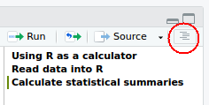

```{r setup, include=FALSE}
# knitr::opts_chunk$set(echo = FALSE, eval = FALSE, comment = "#R: ")
knitr::opts_chunk$set(echo = TRUE, eval = TRUE, comment = "#R: ")
```

# 1. Using R as a calculator

1. Find the values of:

(a) $1+4$
    
```{r}
1 + 4
```

(b) $2^3 + \frac{4}{\sqrt{34}}$
    
```{r}
2^3 + 4 / sqrt(34)
```
    
(c) $\log{30}$
    
```{r}
log(30)
```
    
(d) $\log_{10}30$
    
```{r}
log10(30)
    
# Alternatively:
log(30, base = 10)
```
    
(e) $|-2|$ \hspace{0.2cm}(Hint: $|x|$ denotes the **absolute value** of $x$. Search on Google if you're unsure about which `R` function to use.)
    
```{r}
abs(-2)
```

2. Now open an **R** script by pressing Ctrl $+$ Shift $+$ N. Note, you can
  also open a new script by clicking `File`
  $\rightarrow$ `New` $\rightarrow$ `R script`.
  
3. Save this script by clicking `File` $\rightarrow$
  `Save As...` (Or pressing Ctrl $+$ S). Name the file something 
  meaningful, such as "exercise_1_answers.R", and save it in the Exercises/ directory.

4. Place the cursor at the very top of the R script and press Ctrl $+$ Shift $+$ R. This will insert a new section in your R script. Call this new section "Using R as a calculator". Creating new sections for distinct parts of your code is a very good habit to get in to. 
  
5. Copy and paste (or just write out again) the code you used for question 1a -- 1e into this newly-created R script under the section you just created.

6. You can now submit your script line-by-line by placing the cursor on the line you want to submit and pressing Ctrl $+$ Enter. You can also highlight the code you want to evaluate and press Ctrl $+$ Enter. This will send the highlighted code in the script directly into the console to be evaluated by **R**. Note that you can send multiple lines at once.

7. From now on, type all of your code in an **R** script (create a separate script for each exercise) and
  submit it to the **R** Console using Ctrl $+$ Enter. Don't forget to comment your code to make it easier for you to understand what you did when you look back on this.

# 2. Reading data into **R**

We are going to use Leisure Time and Sports Questionnaire done by ISSP at 2007 for our exercises. Again we only take a small proportion of the survey (`sports demographic.csv`). 

1. Create a section called "Read data into R".

2. Read the CSV file into **R**, and assign to an object named `sports.df`.

```{r, echo = FALSE}
sports.df = read.csv("../../../Data/sports demographic.csv", stringsAsFactors = FALSE)
```

```{r, eval = FALSE}
sports.df = read.csv("Data/sports demographic.csv", stringsAsFactors = FALSE)
```

3. Use the `str()` and `head()` functions to look at some of the  properties of the dataset you have just read into **R**. You should **always** perform this important step to ensure that your data set has been read in correctly.

```{r}
str(sports.df)
head(sports.df)
```

Note that RStudio makes this step really easy. Check out the Environment tab in RStudio (see Figure 1). Compare this to the output you get with the `str()` function.


4. Create a new section in your **R** script called "Calculate statistical summaries".

5. Calculate the median age of the participant.

```{r}
median(sports.df$age)
```

6. What is the youngest age of the participant?

```{r}
min(sports.df$age)
```

7. What is the oldest age of the participant?

```{r}
max(sports.df$age)
```

8. Check the frequency of gender by running `table(sports.df$gender)`.

```{r}
table(sports.df$gender)
```


11. Click on the  icon to see the 3 sections you've created (see figure 2). This allows you to navigate through your **R** code easily by simply clicking on the section. This is one of the main reasons why including sections in your **R** code is a good habit to get in to.




