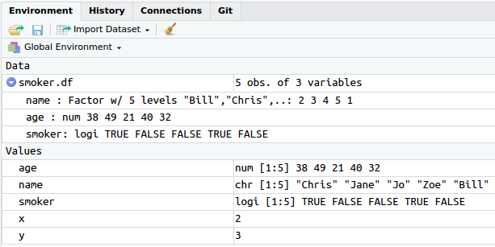
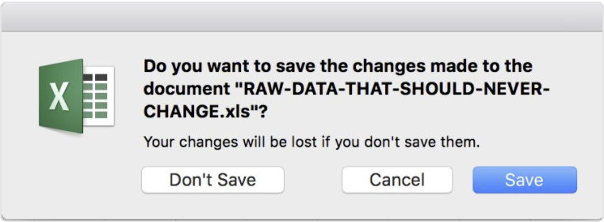
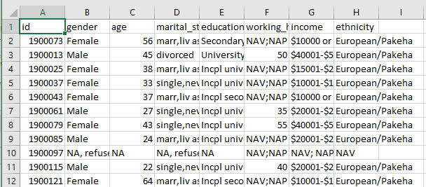
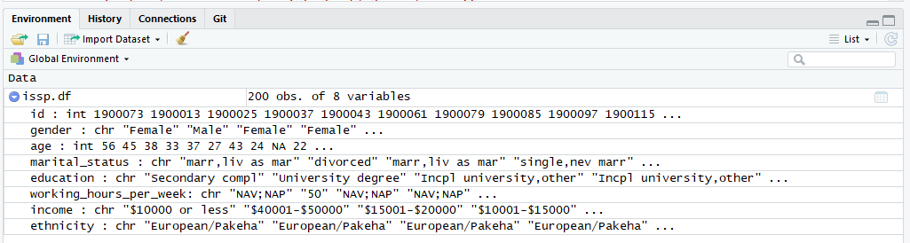
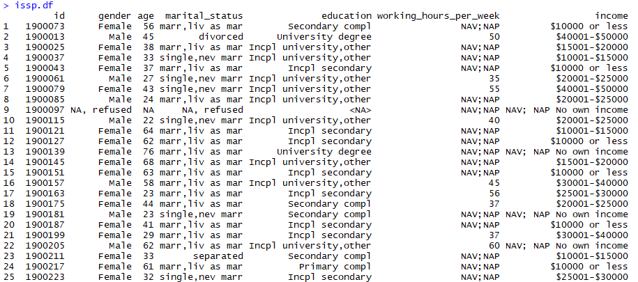

```{r, include = FALSE}
knitr::opts_chunk$set(tidy = FALSE, comment = "#R: ")

library(knitr)
library(kableExtra)
library(tidyverse)
```

## {data-background-iframe="https://www.stat.auckland.ac.nz/scc"}

## Timetable for day 1

Each session comprises two parts:

1. Lecture (~45 minutes)
2. Practical (~45 minutes)

```{r, echo = FALSE, results = "asis"}
tibble(Session = rep(1:4, each = 2, length = 7),
    Time = c("09:00am - 10:30am",
             "10:30am - 11:00am",
             "11:00am - 12:30pm",
             "12:30pm - 01:30pm",
             "01:30pm - 03:00pm",
             "03:00pm - 03:30pm",
             "03:30pm - 05:00pm"),
    Topic = c("Introduction and data import",
              "Break",
              "Clean and subset",
              "Lunch break",
              "Factor and Join",
              "Break",
              "Group and summarise")) %>% 
  kable(format = "html", align = c("ccl")) %>% 
  collapse_rows(columns = 1)
```

## Timetable for day 2

Each session comprises two parts:

1. Lecture (~45 minutes)
2. Practical (~45 minutes)

```{r, echo = FALSE, results = "asis"}
tibble(Session = rep(5:8, each = 2, length = 7),
    Time = c("09:00am - 10:30am",
             "10:30am - 11:00am",
             "11:00am - 12:30pm",
             "12:30pm - 01:30pm",
             "01:30pm - 03:00pm",
             "03:00pm - 03:30pm",
             "03:30pm - 05:00pm"),
    Topic = c("Graphics in **R**",
              "Break",
              "Graphics in **R** with `ggplot2`",
              "Lunch break",
              "Data analysis in **R**",
              "Break",
              "More data analysis")) %>% 
  kable(format = "html", align = c("ccl")) %>% 
  collapse_rows(columns = 1)
```

# A brief history of **R**

## What is **R**?

> **R** is a programming language and free software environment for statistical computing and graphics

- Created by Ross Ihaka and Robert Gentleman of the Department of Statistics, University of Auckland.
- First version was made available in 1995.
- Has become one of the most popular environments for statistical computing and data science.
- We have 3 members of the ***R** Development Core Team* in the Department of Statistics.

You've come to the right people to learn **R**!

## Why is **R** so popular?

- It is open-source!
- It is powerful:
    
    + Can handle large and complex data sets.
    + Easily program complex simulations.
    + Can be used on HPCC.
    
- It is well-supported (SO, R-Bloggers).
- It is flexible (your problem can likely be handled in **R**).
- It runs well on many operating systems (Windows, Mac, and Linux).

You don't need to be a programmer to use **R**!

## How to get **R** and RStudio

1. Go to https://cran.stat.auckland.ac.nz.
2. Download the version relevant to your OS (Linux / Mac / Windows).
3. Install it on your computer.

We *strongly* recommend using the **R** editor called RStudio.

- Download and install it from https://www.rstudio.com/download.
- Great for beginners and advanced use**R**s!

# Setting up an RStudio project {data-background-image="Figure/demo.png" data-background-size="45%" data-background-position="bottom"}

## Session goals

- Use **R** as a calculator
- Data types and data frames
- Import data into **R**
- Calculate simple summary statistics

# Introduction to **R**

## Using **R** as a calculator

```{r}
1 + 2

1 + 3^2

log(15) - sqrt(3.4)

pnorm(1.96)
# This is a comment and is not evaluated
```

## Assigning variables

- `=` is the assignment operator (you can also use `<-`).
- For example, `x = 2` means that we have assigned the value 2 to the object `x`.

```{r}
x = 2
y = 3

x^2 - 3 * y + 5
```

Note that **R** is case-sensitive

```{r, error = TRUE}
X
```

## Variable names in **R** {data-transition="zoom-in none-out"}

You can call an object (almost) anything you like!

### Restrictions:

- Letters (a--zA--Z).
- Numbers (0--9).
- Dot character (.).
- Underline character (_).
- No special characters (`!@$%^&*()` etc.).
- The name must start with a letter.

## Variable names in **R** {data-transition="none-in zoom-out"}

You can call an object (almost) anything you like!

### Suggestions:

- Use lowercase (`age`).
- Use underscores to seperate words (`last_name`).
- Use `.df` when naming a dataframe (`breast_cancer.df`).

Whatever conventions you choose, be consistent.

# Data in **R**

## Data types

**R** has 6 different data types:

- character (alphanumeric; `"hello world"`)
- numeric (real or decimal; `3.14159`)
- integer (whole numbers; `256`)
- logical (`TRUE` or `FALSE`)
- factor (numeric or alphanumeric, treated as categorical)
- complex (numbers with imaginary components; `3i`)

## Vectors

- Use `c()` to combine multiple elements separated by comma's.
- A *vector* is a combination of multiple elements of the same data type.

```{r}
# A character vector contains strings
c("hello", "world")

# A numeric vector contains numbers
c(1, 2, 3, 4, 5, 6)

# We can easily produce sequences using ':'
1:6
```

## Creating a dataframe (data set) within **R**

- A *dataframe* is a collection of multiple vectors (as different columns).
- Each column can be a different data type.
- Use `data.frame` to create a dataframe in **R**.

```{r}
smoker.df = data.frame(
  name = c("Chris", "Jane", "Jo", "Zoe", "Bill"),
  age = c(38, 49, 21, 40, 32),
  smoker = c(TRUE, FALSE, FALSE, TRUE, FALSE))

smoker.df
```

## The Environment pane

The environment pane shows all the objects you have assigned.



# Basic principles for data organisation in spreadsheets

## Whatever you do, do it consistently

Use consistent:

- codes for categorical variables (not M, Male, and male).
- codes for missing values (can use NA, -, or leave blank).

    + Do not use a numeric value (999).

- subject identifiers (mouse153, M153, 153)
- date formats (YYYY-MM-DD, YY/DD/MM)

Also, be careful about spaces within cells. A blank cell is different to a cell with a space in, and "Male" is different to "&#160;Male".

## Choose good names for things

In general: 

- Do not use spaces in variable (column) names or file names.

    + Use underscores or hyphens instead.

- Avoid special characters ($, @, %, #, &, (, ), !, /, etc.).
- Never use "final" in the file name.
- Use short but *meaningful* names.

## Other important guidelines {data-transition="zoom-in none-out"}

- Make it a rectangle!

    + Rows corresponding to subjects (or observations).
    + Columns corresponding to variables.

- Put just one thing in a cell (i.e. separate lat, lon columns).    
- Create a data dictionary.
- No calculations in the raw data files.
- Do not use font colour or highlighting as data.
- Save the data in plain text files (i.e. a CSV).
- Make backups (or use a version control system).

## Other important guidelines {data-transition="none-in zoom-out"}

> Do not overwrite original data files!



## Other important guidelines {data-transition="none-in zoom-out"}

> Wilson G, Bryan J, Cranston K, Kitzes J, Nederbragt L, et al. (2017) Good enough practices in scientific computing. PLOS Computational Biology 13(6): e1005510. https://doi.org/10.1371/journal.pcbi.1005510

# Reading data into **R**

## International Social Survey Programme (ISSP) {data-transition="zoom-in none-out"}

- International Social Survey Programme (ISSP): 1994 - Family and Changing Gender Roles II (Modified)
- The ISSP is a continuing annual programme of cross-national collaboration on surveys covering topics important for social science research (http://www.issp.org).
- COMPASS has run the ISSP survey for New Zealand since 2013. 

## Eight demographic variables in ISSP {data-transition="zoom-in none-out"}

- `id`: Identification number.
- `gender`: Gender of subjects.
- `age`: Age of subjects.
- `marital_status`: martial status of subjects. 
- `education`: Education level.
- `working_hours_per_week`: The average number of hours per week.
- `income`: Individual annual income.
- `ethnicity`: Ethinic group.

## ISSP {data-transition="zoom-in none-out"}



## Read CSV file into **R**

```{r, echo = FALSE}
issp.df = read.csv("../../Data/issp demographic.csv", stringsAsFactors = FALSE)
```

```{r, eval = FALSE}
issp.df = read.csv("Data/issp demographic.csv", stringsAsFactors = FALSE)
```



## Check the data

```{r, eval = FALSE}
issp.df
```



## Check the data

- `dim()` returns the number of observations (rows) and variables (columns).
- `head()` and `tail()` return the first and last few rows of the data set, respectively.
- `names()` returns the names of the variables in the data set.
- `str()` returns the structure of the dataset, e.g. dimension, column names, type of data object, first few values of each variable.

# Descriptive statistics

## Calculating averages

Calculate the average (`mean()`) age:

```{r, error=TRUE}
mean(age)
```

You must tell **R** that `clarity` is a variable (column) *within* the `issp.df` data frame:

```{r}
mean(issp.df$age)
```

## Other (common) statistical summaries

- Median (`median()`)
- Standard deviation (`sd()`)
- Variance (`var()`)
- Minimum (`min()`)
- Maximum (`max()`)
- Quantiles (`quantile()`)
- Interquartile range (`IQR()`)

## Missing values

Sometimes there will be missing values in the data set. We can tell **R** to remove the missing values with `na.rm = TRUE`:

```{r}
mean(issp.df$age)
```

```{r}
mean(issp.df$age, na.rm = TRUE)
```

## Getting help {data-transition="none-out zoom-in"}

- `?`
    
    For example, `?mean` brings up the help file for the `mean` function. It will tell you almost everything you need to know to use `mean()`.

- `??`
    
    For example, `??mean` searches for everything related to "mean" in all the **R** packages installed on your computer.

- `RSiteSearch("mean")`

    Searches everything on CRAN (an online repository of **R** packages). This requires interenet connection.

## Getting help {data-transition="zoom-out none-in"}

- Google!

    + "How to calculate the average in R?"

- Quick-R: https://www.statmethods.net/
- R-Bloggers: https://www.r-bloggers.com/
- Stack Overflow (SO): https://stackoverflow.com/questions/tagged/r
- R Seek: https://rseek.org/

## Summary

- Quick introduction to **R** and RStudio
- Spreadsheet guidelines
- Getting data into **R**
- Calculate statistical summaries

# {data-background-image="Figure/questions.png" data-background-size="50%" data-background-position="bottom"}

# Exercise 1 {data-background-image="Figure/exercise.jpg" data-background-size="82%" data-background-position="bottom"}
