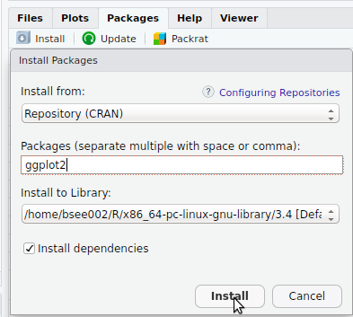
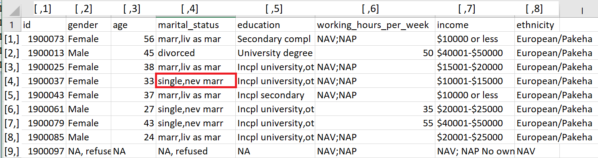
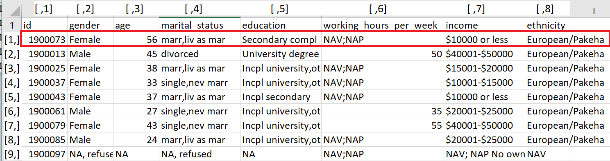
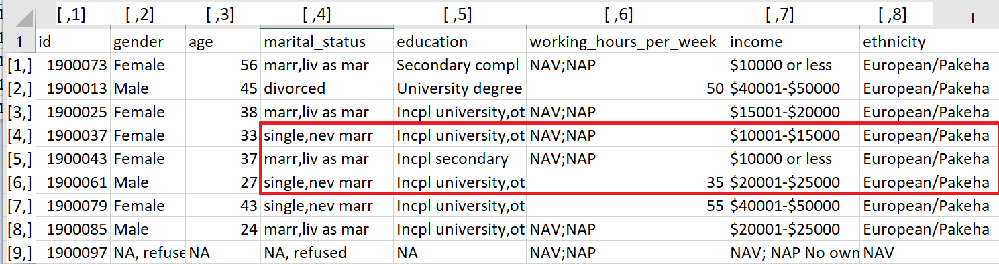
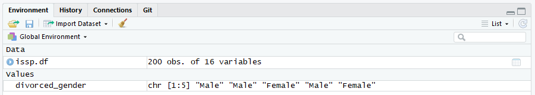
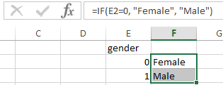

```{r, include = FALSE}
knitr::opts_chunk$set(tidy = FALSE, comment = "#R: ")
options(width = 64)

issp.df = read.csv("../../Data/issp demographic.csv", 
                    stringsAsFactors = FALSE)

library(knitr)
library(kableExtra)
library(tidyverse)
```

# Tips and tricks in RStudio {data-background-image="Figure/demo.png" data-background-size="45%" data-background-position="bottom"}

## Session goals

- Functions in **R**
- Packages
- Subsetting
- Data cleaning

# Functions

## Functions {data-transition="zoom-in none-out"}

A function is a relationship between a set of inputs (arguments) and a set of outputs. The function is fed some information on which it operates, and the results are the output.

```{r, echo = FALSE, message=FALSE, fig.asp=0.5}    
library(plotrix)
plot.new()
plot.window(xlim = c(-8, 8), ylim = c(-1, 1))
draw.circle(-6, 0, 2)
draw.circle(0, 0, 2)
draw.circle(6, 0, 2)
text(c(-6, 0, 6), 0, c("Input", "Function", "Output"), cex = 1.4)
arrows(c(-3.75, 2.25), 0, c(-2.25, 3.75), 0, length = 0.1)
```

## Functions {data-transition="none-in zoom-out"}

We have already seen some **R** functions, e.g. `sd()`, `mean()`, `median()`, etc.

```{r, echo = FALSE, message=FALSE, fig.asp=0.5}    
plot.new()
plot.window(xlim = c(-8, 8), ylim = c(-1, 1))
draw.circle(-6, 0, 2)
draw.circle(0, 0, 2)
draw.circle(6, 0, 2)
text(c(-6, 0, 6), 0, c("c(1, 2, 3, 4)", "mean", "2.5"), cex = 1.4)
arrows(c(-3.75, 2.25), 0, c(-2.25, 3.75), 0, length = 0.1)
```


## The `mean` function in **R**

```{r}
mean(issp.df$age, na.rm = TRUE)
```

- We have to explicitly tell **R** what we want it to do with the missing value. 
- Calculations in **R** are transparent, reproducible, and independent of operating system (unlike software such as Excel).
- When calling a function you can specify arguments by *complete name*, by *position* or by *partial name*.

A set of user-defined functions can be bundled together into an **R** package to provide more functionality to 'base' **R**.


# Packages

## Packages in **R**



- Or `install.packages("ggplot2")`.
- After the installation, use `library(ggplot2)` to load it into **R**.

Only need to install the package/s *once*, but need to load the package/s *everytime* you start **R**. 

## Reading other data files into **R**

- Base **R** (no other packages loaded) only includes functions to read data sets saved in plain text file formats, e.g. `csv`, `txt`, `tsv`, etc.

The [`haven` **R** package](https://CRAN.R-project.org/package=haven) contains functions to import data from other common formats:

```{r, eval = FALSE, tidy = FALSE}
library(haven)
stata.df = read_dta("data.dta")    # STATA DTA format
spss.df = read_sav("data.sav")     # SPSS SAV format
sas.df = read_sas("data.sas7bdat") # SAS sas7bdat format
sasxport.df = read_xpt("data.xpt") # SAS transport format
```

The [`readxl` **R** package](https://CRAN.R-project.org/package=readxl) contains functions for Excel files:

```{r, eval = FALSE, tidy = FALSE}
library(readxl)
excel.df = read_xlsx("data.xlsx")  # Excel XLSX spreadsheet
```

# Subsetting

## Extract a subset from a variable {data-transition="zoom-in none-out"}

Square brackets `[` and `]` are used to extract subsets of data.

```{r}
# Extract the genders for all subjects
issp.df$gender

```

## Extract a subset from a variable {data-transition="none-in none-out"}

Square brackets `[` and `]` are used to extract subsets of data.

```{r}
# Extract the gender of the tenth subject
issp.df$gender[10]

# Extract the genders for the first 5 subjects
issp.df$gender[1:5]

# Extract the genders for all but the first 5 subjects
issp.df$gender[-(1:5)]
```

## Extract a subset from a variable {data-transition="none-in zoom-out"}

Square brackets `[` and `]` are used to extract subsets of data.

```{r}
# Extract the genders from the third, through to the eighth subject
issp.df$gender[3:8]

# Extract the genders from the third and the eighth subject
issp.df$gender[c(3, 8)]
```

## Subsetting dataframes --- A single element

Subsetting dataframes requires *two* indices because they are 2-d:

```
[rows, cols]
```



## Subsetting dataframes --- A single element


```{r}
# Extract the element in the 4th row down and 4th column across
issp.df[4, 4]
```


## Subsetting dataframes --- A single row



```{r, echo = FALSE}
options(width = 200)
```

```{r}
# Extract all data (all columns) for the first row
issp.df[1, ]
```

```{r, echo = FALSE}
options(width = 64)
```

## Subsetting dataframes --- A single column

We have already seen that we can extract a single column using `$` (`issp.df$gender`), but we can also use a numeric index:

```{r}
# Extract all data (all rows) for the 2nd column ()
issp.df[, 2]
```

## Subsetting dataframes



```{r}
# Extract the elements from rows 4 to 6, and from columns 4 to 8
issp.df[4:6, 4:8]
```

# Subsetting using logical expressions

## Which subjects are `divorced`? {data-transition="zoom-in none-out"}


```{r}
# Show the marital Status of first 10 subjects
issp.df$marital_status[1:10]
```

## Which subjects are `divorced`? {data-transition="none-in none-out"}

We can use a logical expression to return a vector of `TRUE`'s and `FALSE`'s.

```{r}
# Return a logical vector for the expression 'marital_status' equals (==) divorced
issp.df$marital_status == "divorced"
```

## What are subjects' `gender` who are `divorced`? {data-transition="none-in zoom-out"}

We can use this logical expression to subset the `site_name` variable.

```{r}
# Return the genders of subjects who are divorced
issp.df$gender[issp.df$marital_status == "divorced"]
```

## The `with` function

Notice that in the previous line of code `issp.df$gender[issp.df$marital_status == "divorced"]`, you have to type `issp.df$` twice? 

We can simplify the code with the `with` function:

```{r}
# Return the genders of subjects who are divorced
with(issp.df, gender[marital_status == "divorced"])
```

The `with` function tells **R** which dataframe to look in for the variables.

## What are subjects' `gender` who are `divorced`? {data-transition="none-in zoom-out"}

We can even assign the output to a variable so we don't need to type the code out every time we want to see the genders of subjects who are divorced:

```{r}
# Assign the genders of subjects who are divorced
divorced_gender = with(issp.df, gender[marital_status == "divorced"])
divorced_gender
```

## So how many?

We can use the `length()` function to see how many subjects are divorced.

```{r}
length(divorced_gender)
```

We can also easily see this in RStudio in the Environment panel:
 


## Logical operators in **R**

```{r, echo = FALSE}
data.frame(Operator = c("<", "<=", ">", ">=", "==", "!=", "!x", "x | y", 
                        "x & y"),
           Description = c("less than", "less than or equal to",
                           "greater than", "greater than or equal to",
                           "exactly equal to", "not equal to", "not x",
                           "x OR y", "x AND y")) %>% 
  kable(format = "html")
```

## A more complex example

Suppose we want to know genders of the subjects who are single and over age of 70.

```{r}
# Return genders for marital_status == "single,nev marr" AND age > 70
with(issp.df, gender[marital_status == "single,nev marr" & age > 70])
```

There are two males and three females.

# Data cleaning

## The `ifelse()` function

```
IF (test is TRUE){
  THEN yes
  ELSE no
}
```



```{r}
gender = c(0, 1)

ifelse(gender == 0, "Female", "Male")
```

Note that the `ifelse` function in **R** has the same format as the `IF` function in MS Excel.


## Cleaning up the `gender` variable (missing value)

```{r, tidy = FALSE}
table(issp.df$gender)
```

The `ifelse()` function provides a quick way to convert the missing values in `gender` variable from `"NA, refused"` to `NA`.

```{r, tidy = FALSE}
# Convert from `"NA, refused"` to `NA`
issp.df$gender = 
  with(issp.df, ifelse(gender == "NA, refused",
                       NA, gender))
issp.df$gender[1:10]
```

> Note `NA` does not need quotation. 

## Missing values {data-transition="zoom-in none-out"}

- Now We have a missing value in `gender` variable. 

Use `is.na()` to search for the missing value in the variable:

```{r}
is.na(issp.df$gender)
```

But which one is missing?

## Missing values {data-transition="none-in none-out"}

Use `which` to return the index of the `TRUE`'s:

```{r}
which(is.na(issp.df$gender))
```

## Missing values in variables: `marital_status`, `working_hours_per_week` and `income` {data-transition="none-in none-out"}

```{r}
# Other variables
issp.df$marital_status = 
  with(issp.df, ifelse(marital_status == "NA, refused",
                       NA, marital_status))

issp.df$income = 
  with(issp.df, ifelse(income == "NAV; NAP No own income", 
                       NA, income))

issp.df$working_hours_per_week = 
  with(issp.df,
       ifelse(working_hours_per_week == "DK,cant say" |
                working_hours_per_week == "NAV;NAP", 
              NA, working_hours_per_week))

```


## Coerce to numeric vector from character vector using `as.numeric()`

```{r}
#Print out the working hour per week of the first ten subjects
issp.df$working_hours_per_week[1:10]

# Coerce to numeric vector from character vector
issp.df$working_hours_per_week = 
  as.numeric(issp.df$working_hours_per_week)

#Print out the the working hour per week of the first ten subjects
issp.df$working_hours_per_week[1:10]

# Compute the mean (without the missing values)
mean(issp.df$working_hours_per_week, na.rm = TRUE)
```

## Cleaning up the `ethnicity` variable {data-transition="none-in none-out"}

```{r}
table(issp.df$ethnicity)
```

## Cleaning up the `ethnicity` variable {data-transition="none-in none-out"}

```{r, echo = FALSE, results = "asis"}
tibble(
    `Old ethnicity` = names(table(issp.df$ethnicity)),
   `New ethnicity` = c("Asian", "Euro", NA, "Maori", "Other",
                      "Pacific")) %>% 
  kable(format = "html", align = c("lr"))
```

## Cleaning up the `ethnicity` variable {data-transition="none-in none-out"}

We can nest `ifelse()` statements:

```{r, tidy=FALSE}
issp.df$ethnicity =
  with(issp.df, 
       ifelse(ethnicity == "Chinese", "Asian", 
              ifelse(ethnicity == "European/Pakeha", "Euro", 
                     ifelse(ethnicity == "NAV", NA, 
                            ifelse(ethnicity == "New Zealand Maori", "Maori", 
                                   ifelse(ethnicity == "Other", "Other",
                                          "Pacific"))))))

table(issp.df$ethnicity)
```


## Summary

- Functions in **R**
- Installing and loading **R** packages
- Subsetting vectors and datasets
- Logical expressions
- Cleaning data with `ifelse()`

# {data-background-image="../Logos/questions.png" data-background-size="50%" data-background-position="bottom"}

# Exercise 2 {data-background-image="../Logos/exercise.jpg" data-background-size="82%" data-background-position="bottom"}

