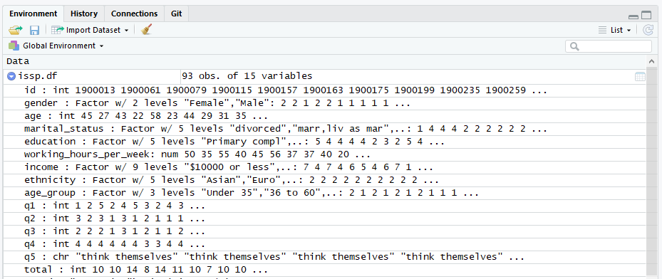

```{r, include = FALSE}
knitr::opts_chunk$set(tidy = TRUE, comment = "#R: ")
options(width = 64)

gw = getwd()
setwd("../../")
source(textConnection(readLines("Source/session_2.R")))
setwd(gw)

library(knitr)
library(kableExtra)
library(tidyverse)
```

## Session goals

- Factor
- Reshape data (wide to long)
- Create new variables
- Finalize our data set!


# `factor`

## `factor`

- A variable which takes either qualitative values, ordinal values or a discrete set of quantitative values. The values of a `factor` are called its **levels**.

- Examples of factors:  

    + `gender` with 2 **qualitative** levels: `Male` and `Female`.
    + `education` with 6 **ordinal** levels: `None` $<$ `Primary compl` $<$ `Incpl secondary` $<$ `Secondary compl` $<$ `Incpl university` $<$ `University degree`.
    + `income` has 9 **quantitative** levels when the mid-values of the income ranges are used: 5000, 12500, 17500, 22500, 27500, 35000, 45000, 60000 and 85000.

## `factor` {data-transition="none-in zoom-out"}

- `factor()` is used to encode a `vector` as a `factor`

```{r}
issp.df$gender = factor(issp.df$gender)
issp.df$ethnicity = factor(issp.df$ethnicity)
issp.df$marital_status = factor(issp.df$marital_status)
issp.df$income = factor(issp.df$income)

str(issp.df)
```


## `factor` {data-transition="none-in zoom-out"}

- **R** stores two *additional* pieces of information for each `factor`:

    + the unique set of levels and 
    + an integer value, assigned by **R**, for each unique level.
    
- The integer values are assigned to `factor` levels, so that they have an order associated with them.
- By default, the unique levels are assigned the values 1, 2,..., according to ascending *alphabetical order*. 

## `factor` {data-transition="none-in zoom-out"}

```{r}
# Check the levels of factor on education variable of issp.df
levels(factor(issp.df$education))
```

> This is not always appropriate! 

## `factor` on `issp.df$education` {data-transition="none-in zoom-out"}
- Appropriate order of `education` in `issp.df`

```{r, echo = FALSE, results = "asis"}
tibble(
    Level = c("Incpl secondary",
             "Incpl university,other",
             "Primary compl",
             "Secondary compl",
             "University degree"),
  `Appropriate order` = c("1",
              "2",
              "3",
              "4",
              "5")) %>% 
  kable(format = "html", align = c("lr"))
```

## `factor` on `issp.df$education` {data-transition="none-in zoom-out"}

```{r, tidy = FALSE}
# Tabulate response on education, notice the order
table(issp.df$education)

# Encode a vector as a factor with appropriate order
issp.df$education = factor(issp.df$education, 
                    levels = c("Primary compl", 
                               "Incpl secondary", 
                               "Secondary compl", 
                               "Incpl university,other", 
                               "University degree"))

```

## `factor` on `issp.df$education` {data-transition="none-in zoom-out"}

```{r, tidy = FALSE}
# Re-tabulate response on education, notice the order
table(issp.df$education)
```

# Creating a new variable

## Binning `age` variable into age groups {data-transition="none-in none-out"}

- Often we want to categorize continuous variables (e.g. age group).
- We can easily `ifelse` function to bin a continuous variable into separate groups:

    + **Under 35**: age $\leq$ 35
    + **36 to 60**: age $\leq$ 60
    + **Over 60**: (age $\leq \infty$)

## Binning `age` variable into age groups {data-transition="none-in none-out"}

- We can first nest `ifelse()` statements and then convert the newly created variables `age_group` to a `factor` with `levels` in ascending order:

```{r, tidy = FALSE}
# Binning age variable into age_groups with nested ifelse functions
age_group = with(issp.df, 
                 ifelse(age <= 35, "Under 35", 
                        ifelse(age <= "60", "36 to 60", 
                               "Over 61")))

# Convert age_group to a factor with levels in ascending order.
age_group = 
  factor(age_group, 
         levels = c("Under 35", "36 to 60", "Over 61"))

```

## Create a new variable `age_group` in `issp.df` dataset {data-transition="none-in none-out"}

- We can create a new variable in dataframe using `$`. 
- If this variable is already define, then it will *overwrite* new values into an existing variable in this dataframe. 

```{r}
# Create a new variable age_group in issp.df
issp.df$age_group = age_group

str(issp.df)
```

# Questionnaire

## Questionnaire {data-transition="none-in none-out"}

- Questionnaire usually comprise many items.
- Sometimes we add the *likert scale* of a set of questions (from the same section) to obtain a score. Then we will assume it's a measure of a certain aspect.
- For example, World Health Organisation Quality of Life (WHOQOL) measures. It develops three scores (physical score, psychosocial score and total generic score) from a large number of questions.

## Read in the other data set

- Currently, our `issp.df` data set contains demographic information of each subject.
- We now have another data called `issp questionnaire.csv` containing the results from the Questionnaire.
- Before we can combine these 2 data sets, we need to read in the other data set:

```{r, eval = FALSE, tidy = FALSE}
likert.df = read.csv("Data/issp questionnaire.csv", 
                         stringsAsFactors = FALSE)

str(likert.df)
```

```{r, echo = FALSE}
likert.df = read.csv("../../Data/issp questionnaire.csv", 
                         stringsAsFactors = FALSE)

str(likert.df)
```

## ISSP Questionnaire {data-transition="zoom-in none-out"}

- Question 1 to 4, choose from one of the following: Agree strongly, Agree, Neither agree nor disagree, Disagree, Disagree strongly, Can't choose.

    + `Q1`: Both the man and the woman should contribute to the household income.
    + `Q2`: A man's job is to earn money: a woman's job is to look after the home and family.
    + `Q3`: It is not good if the man stays at home and cares for the children and the woman goes out to work.
    + `Q4`: Family life often suffers because men concentrate too much on their work.

## ISSP Questionnaire {data-transition="zoom-in none-out"}

- `Q5`:   Which of these would you say is more important in preparing children for life?
to be obedient, to think for themselves, or Can't choose.

> Now we have two datasets: `issp.df` and `likert.df`. 


# Combining data sets

## The unique ID's {data-transition="zoom-in none-out"}

- We need to ensure that we don't have any duplicates in our ID variable.
- The output from `anyDuplicated` is 0 if there are no duplicates.

```{r}
anyDuplicated(issp.df$id)
anyDuplicated(likert.df$id)
```


## The `dplyr` **R** package for joining {data-transition="zoom-in none-out"}

- The `dplyr` **R** package provides some useful functions for data manipulation.

```{r}
library(dplyr)
```

#### There are 4 common joins:

- Left join
- Right join
- Full join
- Inner join

# Types of joins

## Example data sets

To exemplify the four common types of joins, we will use `x.df` and `y.df`:

```{r}
x.df = data.frame(id = c(1, 2, 3), x_val = c("x1", "x2", "x3"))
y.df = data.frame(id = c(1, 2, 4), y_val = c("y1", "y2", "y4"))
```

<table class="table" style="width: auto !important; margin-left: 0; margin-right: auto;display:inline-table;;margin-right: 100px">
<caption style="padding-bottom: 20px; font-size: 30pt; font-family: 'Courier New'">
x.df
</caption>
<thead>
<tr>
<th style="text-align:right;">
id
</th>
<th style="text-align:left;">
x_val
</th>
</tr>
</thead>
<tbody>
<tr>
<td style="text-align:right;">
1
</td>
<td style="text-align:left;">
x1
</td>
</tr>
<tr>
<td style="text-align:right;">
2
</td>
<td style="text-align:left;">
x2
</td>
</tr>
<tr>
<td style="text-align:right;">
3
</td>
<td style="text-align:left;">
x3
</td>
</tr>
</tbody>
</table>
<table class="table" style="width: auto !important; margin-right: 0; margin-left: auto;display:inline-table">
<caption style="padding-bottom: 20px; font-size: 30pt; font-family: 'Courier New'">
y.df
</caption>
<thead>
<tr>
<th style="text-align:right;">
id
</th>
<th style="text-align:left;">
y_val
</th>
</tr>
</thead>
<tbody>
<tr>
<td style="text-align:right;">
1
</td>
<td style="text-align:left;">
y1
</td>
</tr>
<tr>
<td style="text-align:right;">
2
</td>
<td style="text-align:left;">
y2
</td>
</tr>
<tr>
<td style="text-align:right;">
4
</td>
<td style="text-align:left;">
y4
</td>
</tr>
</tbody>
</table>

## Left join

- Return all the rows from `x.df`.
- Return all the rows from `y.df` that match `x.df`.

```{r}
left_join(x.df, y.df, by = "id")
```

<table class="table" style="width: auto !important; margin-left: 0; margin-right: 0;display:inline-table;;margin-right: 100px">
<caption style="padding-bottom: 20px; font-size: 30pt; font-family: 'Courier New'">
x.df
</caption>
<thead>
<tr>
<th style="text-align:right;">
id
</th>
<th style="text-align:left;">
x_val
</th>
</tr>
</thead>
<tbody>
<tr>
<td style="text-align:right;">
1
</td>
<td style="text-align:left;">
x1
</td>
</tr>
<tr>
<td style="text-align:right;">
2
</td>
<td style="text-align:left;">
x2
</td>
</tr>
<tr>
<td style="text-align:right;">
3
</td>
<td style="text-align:left;">
x3
</td>
</tr>
</tbody>
</table>

<table class="table" style="width: auto !important; margin-right: 0; margin-left: 0;display:inline-table">
<caption style="padding-bottom: 20px; font-size: 30pt; font-family: 'Courier New'">
y.df
</caption>
<thead>
<tr>
<th style="text-align:right;">
id
</th>
<th style="text-align:left;">
y_val
</th>
</tr>
</thead>
<tbody>
<tr>
<td style="text-align:right;">
1
</td>
<td style="text-align:left;">
y1
</td>
</tr>
<tr>
<td style="text-align:right;">
2
</td>
<td style="text-align:left;">
y2
</td>
</tr>
<tr>
<td style="text-align:right;">
4
</td>
<td style="text-align:left;">
y4
</td>
</tr>
</tbody>
</table>

<table class="table" style="width: auto !important; margin-right: 0; margin-left: 150px;display:inline-table">
<caption style="padding-bottom: 20px; font-size: 30pt">
 
</caption>
<thead><tr>
<th style="text-align:right;"> id </th>
   <th style="text-align:left;"> x_val </th>
   <th style="text-align:left;"> y_val </th>
  </tr></thead>
<tbody>
<tr>
<td style="text-align:right;"> 1 </td>
   <td style="text-align:left;"> x1 </td>
   <td style="text-align:left;"> y1 </td>
  </tr>
<tr>
<td style="text-align:right;"> 2 </td>
   <td style="text-align:left;"> x2 </td>
   <td style="text-align:left;"> y2 </td>
  </tr>
<tr>
<td style="text-align:right;"> 3 </td>
   <td style="text-align:left;"> x3 </td>
   <td style="text-align:left;"> NA </td>
  </tr>
</tbody>
</table>

## Right join

- Return all the rows from `y.df`.
- Return all the rows from `x.df` that match `y.df`.

```{r}
right_join(x.df, y.df, by = "id")
```

<table class="table" style="width: auto !important; margin-left: 0; margin-right: 0;display:inline-table;;margin-right: 100px">
<caption style="padding-bottom: 20px; font-size: 30pt; font-family: 'Courier New'">
x.df
</caption>
<thead>
<tr>
<th style="text-align:right;">
id
</th>
<th style="text-align:left;">
x_val
</th>
</tr>
</thead>
<tbody>
<tr>
<td style="text-align:right;">
1
</td>
<td style="text-align:left;">
x1
</td>
</tr>
<tr>
<td style="text-align:right;">
2
</td>
<td style="text-align:left;">
x2
</td>
</tr>
<tr>
<td style="text-align:right;">
3
</td>
<td style="text-align:left;">
x3
</td>
</tr>
</tbody>
</table>

<table class="table" style="width: auto !important; margin-right: 0; margin-left: 0;display:inline-table">
<caption style="padding-bottom: 20px; font-size: 30pt; font-family: 'Courier New'">
y.df
</caption>
<thead>
<tr>
<th style="text-align:right;">
id
</th>
<th style="text-align:left;">
y_val
</th>
</tr>
</thead>
<tbody>
<tr>
<td style="text-align:right;">
1
</td>
<td style="text-align:left;">
y1
</td>
</tr>
<tr>
<td style="text-align:right;">
2
</td>
<td style="text-align:left;">
y2
</td>
</tr>
<tr>
<td style="text-align:right;">
4
</td>
<td style="text-align:left;">
y4
</td>
</tr>
</tbody>
</table>

<table class="table" style="width: auto !important; margin-right: 0; margin-left: 150px;display:inline-table">
<caption style="padding-bottom: 20px; font-size: 30pt">
 
</caption>
<thead><tr>
<th style="text-align:right;"> id </th>
   <th style="text-align:left;"> x_val </th>
   <th style="text-align:left;"> y_val </th>
  </tr></thead>
<tbody>
<tr>
<td style="text-align:right;"> 1 </td>
   <td style="text-align:left;"> x1 </td>
   <td style="text-align:left;"> y1 </td>
  </tr>
<tr>
<td style="text-align:right;"> 2 </td>
   <td style="text-align:left;"> x2 </td>
   <td style="text-align:left;"> y2 </td>
  </tr>
<tr>
<td style="text-align:right;"> 4 </td>
   <td style="text-align:left;"> NA </td>
   <td style="text-align:left;"> y4 </td>
  </tr>
</tbody>
</table>

## Full join

- Return all the rows from `x.df` and `y.df`.

```{r}
full_join(x.df, y.df, by = "id")
```

<table class="table" style="width: auto !important; margin-left: 0; margin-right: 0;display:inline-table;;margin-right: 100px">
<caption style="padding-bottom: 20px; font-size: 30pt; font-family: 'Courier New'">
x.df
</caption>
<thead>
<tr>
<th style="text-align:right;">
id
</th>
<th style="text-align:left;">
x_val
</th>
</tr>
</thead>
<tbody>
<tr>
<td style="text-align:right;">
1
</td>
<td style="text-align:left;">
x1
</td>
</tr>
<tr>
<td style="text-align:right;">
2
</td>
<td style="text-align:left;">
x2
</td>
</tr>
<tr>
<td style="text-align:right;">
3
</td>
<td style="text-align:left;">
x3
</td>
</tr>
</tbody>
</table>

<table class="table" style="width: auto !important; margin-right: 0; margin-left: 0;display:inline-table">
<caption style="padding-bottom: 20px; font-size: 30pt; font-family: 'Courier New'">
y.df
</caption>
<thead>
<tr>
<th style="text-align:right;">
id
</th>
<th style="text-align:left;">
y_val
</th>
</tr>
</thead>
<tbody>
<tr>
<td style="text-align:right;">
1
</td>
<td style="text-align:left;">
y1
</td>
</tr>
<tr>
<td style="text-align:right;">
2
</td>
<td style="text-align:left;">
y2
</td>
</tr>
<tr>
<td style="text-align:right;">
4
</td>
<td style="text-align:left;">
y4
</td>
</tr>
</tbody>
</table>

<table class="table" style="width: auto !important; margin-right: 0; margin-left: 150px;display:inline-table">
<caption style="padding-bottom: 20px; font-size: 30pt">
</caption>
<thead><tr>
<th style="text-align:right;"> id </th>
   <th style="text-align:left;"> x_val </th>
   <th style="text-align:left;"> y_val </th>
  </tr></thead>
<tbody>
<tr>
   <td style="text-align:right;"> 1 </td>
   <td style="text-align:left;"> x1 </td>
   <td style="text-align:left;"> y1 </td>
  </tr>
<tr>
   <td style="text-align:right;"> 2 </td>
   <td style="text-align:left;"> x2 </td>
   <td style="text-align:left;"> y2 </td>
  </tr>
<tr>
   <td style="text-align:right;"> 3 </td>
   <td style="text-align:left;"> x3 </td>
   <td style="text-align:left;"> NA </td>
  </tr>
<tr>
   <td style="text-align:right;"> 4 </td>
   <td style="text-align:left;"> NA </td>
   <td style="text-align:left;"> y4 </td>
  </tr>
</tbody>
</table>

## Inner join

- Return all the rows with matching ID from both data sets.

```{r}
inner_join(x.df, y.df, by = "id")
```

<table class="table" style="width: auto !important; margin-left: 0; margin-right: 0;display:inline-table;;margin-right: 100px">
<caption style="padding-bottom: 20px; font-size: 30pt; font-family: 'Courier New'">
x.df
</caption>
<thead>
<tr>
<th style="text-align:right;">
id
</th>
<th style="text-align:left;">
x_val
</th>
</tr>
</thead>
<tbody>
<tr>
<td style="text-align:right;">
1
</td>
<td style="text-align:left;">
x1
</td>
</tr>
<tr>
<td style="text-align:right;">
2
</td>
<td style="text-align:left;">
x2
</td>
</tr>
<tr>
<td style="text-align:right;">
3
</td>
<td style="text-align:left;">
x3
</td>
</tr>
</tbody>
</table>

<table class="table" style="width: auto !important; margin-right: 0; margin-left: 0;display:inline-table">
<caption style="padding-bottom: 20px; font-size: 30pt; font-family: 'Courier New'">
y.df
</caption>
<thead>
<tr>
<th style="text-align:right;">
id
</th>
<th style="text-align:left;">
y_val
</th>
</tr>
</thead>
<tbody>
<tr>
<td style="text-align:right;">
1
</td>
<td style="text-align:left;">
y1
</td>
</tr>
<tr>
<td style="text-align:right;">
2
</td>
<td style="text-align:left;">
y2
</td>
</tr>
<tr>
<td style="text-align:right;">
4
</td>
<td style="text-align:left;">
y4
</td>
</tr>
</tbody>
</table>

<table class="table" style="width: auto !important; margin-right: 0; margin-left: 150px;display:inline-table">
<caption style="padding-bottom: 20px; font-size: 30pt">
 
</caption>
<thead><tr>
<th style="text-align:right;"> id </th>
   <th style="text-align:left;"> x_val </th>
   <th style="text-align:left;"> y_val </th>
  </tr></thead>
<tbody>
<tr>
<td style="text-align:right;"> 1 </td>
   <td style="text-align:left;"> x1 </td>
   <td style="text-align:left;"> y1 </td>
  </tr>
<tr>
<td style="text-align:right;"> 2 </td>
   <td style="text-align:left;"> x2 </td>
   <td style="text-align:left;"> y2 </td>
  </tr>
</tbody>
</table>


## Join the issp data set {data-transition="zoom-in none-out"}

We will choose the `full_join()` function of `dplyr` for our data set:

```{r}
issp.df = full_join(issp.df, likert.df, by = "id")

str(issp.df)
```

## Create new variable `total` score 

- Suppose we sum the likert scales from Q1 to Q4 to get a "total score".
- We can create a new variable to `issp.df` using the `$` operator. 

```{r}
# Sum the likert scales from q1 -- q4 to a new variable call `total`` 
total = with(issp.df, q1 + q2 + q3 + q4)

issp.df$total = total
```


# Finalise issp data set

##  Finalise issp data set  {data-transition="zoom-in none-out"}

- `na.omit()` returns the object with listwise deletion of missing values. That is an entire record is excluded if any single value is missing.

```{r}
issp.df = na.omit(issp.df)

str(issp.df)
```


## Our final data set  {data-transition="zoom-in none-out"}



## Summary  {data-transition="zoom-in none-out"}

- `factor`
- Create new variables
- Combine data sets with `dplyr`
- Finalise our data set

# {data-background-image="../Logos/questions.png" data-background-size="50%" data-background-position="bottom"}

# Exercise 3 {data-background-image="../Logos/exercise.jpg" data-background-size="82%" data-background-position="bottom"}

